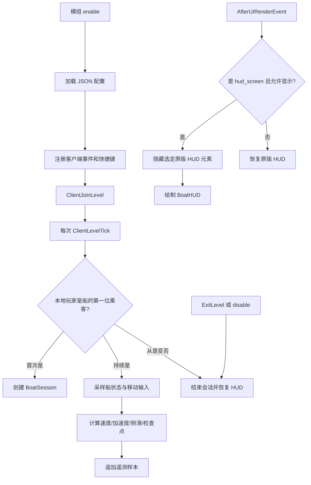

# 基于 LeviLamina 实现 BoatHUD (Extended) 的 API 对照与可行性分析

## 1. 结论摘要

结论是：**可以在 LeviLamina 客户端模组中实现 BoatHUD (Extended) 的绝大多数功能**，而且关键能力并不缺失。

- 常驻 HUD：可实现。使用 `AfterUIRenderEvent` 取得 `ScreenView` 与 `MinecraftUIRenderContext`，可以绘制文字、矩形、图片并读取 GUI 尺寸。
- 隐藏原版 HUD：可直接实现。`GuiData::setHudVisibilityState` 可分别隐藏快捷栏、生命、饥饿、护甲、经验条、气泡等元素。
- 船只检测、速度、加速度、侧滑角：可实现。客户端 Tick 中读取本地玩家、载具、船的速度和旋转即可。
- 键盘/手柄/触摸移动输入：可实现，但建议读取 Bedrock 的 `MoveInputComponent`，而不是只监听原始键盘事件。
- Ping：可直接读取 `IClientInstance::getServerPingTime()`。
- FPS：没有发现稳定的 LL 高层 FPS API；可通过 UI 渲染事件计数得到近似 FPS，也可读取内部 `ProfilerLite` 获得原生值，但后者版本风险更高。
- 遥测 CSV、检查点和差值计算：均可用 C++ 标准库与 LL 配置/目录 API 实现。
- 配置持久化：可直接使用 `ll::config::loadConfig/saveConfig` 的 JSON 配置系统。
- 图形配置页：**没有发现等价于 Fabric Mod Menu + Cloth Config 的纯客户端高层 API**。LL 的 Form 与 Data-driven UI 是服务器侧对玩家发起的表单，不适合作为任意远程服务器上都能使用的纯客户端设置页。可以自行用渲染及输入事件做配置覆盖层。

因此，核心 HUD 的实现可行度很高；最主要的差异是“配置 GUI 没有现成 Mod Menu 等价物”和“稳定、精确的 FPS API 缺失”。按功能完整度估计，使用公开 LL API 加少量当前版本 MCAPI 可达到原模组约 **90%～95% 的功能等价度**。

## 2. 调研范围与版本基线

本分析交叉阅读了以下内容：

1. LeviLamina 中文用户文档、开发架构、客户端安装、构建和首个模组教程。
2. API Reference 中的 Event、Input、Config、Mod、Service、Thread、Chrono、Form、Data-driven UI、Network、I18n、IO、Command、Hook 等模块。
3. 当前 LeviLamina `main` 分支中实际公开的客户端头文件与相关实现，重点核对事件是否真实触发、调用顺序和 API 签名。
4. 当前仓库中的 Java BoatHUD (Extended) 源码及 [PROJECT_IMPLEMENTATION_LOGIC.md](PROJECT_IMPLEMENTATION_LOGIC.md)。

调研快照：

| 项目 | 基线 |
| --- | --- |
| 调研日期 | 2026-09-26 |
| LeviLamina 源码提交 | `b3ff77f271193b0833294a9a04e4f46fafe90b36`，2026-09-22 |
| 当前文档版本表 | LeviLamina 26.51.x 对应服务端/客户端 26.51.1 |
| 平台 | Windows 10/11 x64、C++20/部分 C++23 |
| 目标类型 | 必须以 `--target_type=client` 构建 |

LeviLamina 同时包含两类接口：

- `LLAPI`：LeviLamina 自己维护的稳定封装，例如事件、配置、键位注册、`GuiData::setHudVisibilityState`。
- `MCAPI` 或自动生成的 Minecraft 头文件：直接暴露 Bedrock 客户端类型和方法，例如 `Actor::getVehicle()`、`ClientMoveInputHandler::getMoveInput()`。它们非常有用，但随游戏版本变动的概率更高。

本项目应固定 LeviLamina 与 Minecraft 客户端版本，不能假设一次编译出的 DLL 可跨多个大版本长期工作。

## 3. Java BoatHUD 功能与 LeviLamina API 对照

| BoatHUD (Extended) 功能 | LeviLamina/Bedrock 对应能力 | 可行性 | 稳定性与说明 |
| --- | --- | --- | --- |
| 判断玩家正在驾驶船 | `getLocalPlayer()`、`Actor::getVehicle()`、`getFirstPassenger()`、`ActorType::BoatRideable/ChestBoatRideable` | 可直接实现 | 高；每 Tick 检查比依赖乘客包 Hook 更稳健 |
| 每 Tick 更新会话数据 | `ClientLevelTickEvent` | 可直接实现 | 高；当前事件在 `ClientLevel::$_subTick` 原函数之前发布 |
| 读取船的速度 | `Actor::getVelocity()` | 可直接实现 | 高 |
| 读取位置和朝向 | `getPosition()`、`getRotation()` | 可直接实现 | 高 |
| 速度、纵横向加速度、侧滑角 | C++ 数学运算 | 完整可实现 | 高；可原样移植公式并修复角度跨界问题 |
| 方向/油门状态 | `ClientMoveInputHandler::getMoveInput()`、`MoveInputComponent` | 可实现 | 中；属于生成的 MCAPI，但能覆盖改键、手柄和触摸 |
| 输入轨迹 | `std::deque`/环形数组 | 完整可实现 | 高 |
| Ping | `IClientInstance::getServerPingTime()` | 可直接实现 | 中高；属于客户端 MCAPI |
| FPS | 渲染事件计数；或内部 `ProfilerLite::mFPS` | 可实现 | 计数法高稳定但为近似值；内部值精确但脆弱 |
| 扩展/紧凑 HUD | `AfterUIRenderEvent` + `MinecraftUIRenderContext` | 完整可实现 | 高 |
| 文字绘制及宽度测量 | `drawText()`、`getLineLength()`、`flushText()`、客户端字体 | 可实现 | 中高；需要正确处理批次刷新 |
| 速度条、G 值点、背景和轨迹 | `fillRectangle()`、`drawRectangle()`、`drawImage()` 或 `ScreenRenderer` | 完整可实现 | 中高 |
| 使用 `widgets.png` 图集 | 模组 `resource_packs` 自动加载 + UI 纹理 API | 可实现 | 中；需改造成 Bedrock 资源包并验证材质/UV |
| 隐藏原版状态栏/快捷栏 | `GuiData::setHudVisibilityState()` | 可直接实现 | 高；LL 已提供封装 |
| 聊天、暂停或其他页面隐藏 BoatHUD | `ScreenView::getScreenName()`、`getTopScreenName()` | 可实现 | 中高；页面名需要在目标版本实机确认 |
| 遥测 CSV | `Mod::getDataDir()` + `std::ofstream` | 完整可实现 | 高 |
| 检查点读取和差值计算 | C++ 文件/JSON/CSV 与数学计算 | 完整可实现 | 高 |
| JSON 配置与迁移 | `ll::config::loadConfig/saveConfig` | 可直接实现 | 高 |
| 开关 HUD 的自定义键位 | `KeyRegistry::getOrCreateKey()`、`KeyHandle` | 可直接实现 | 高；支持重映射 |
| 客户端命令 | `ClientCommandRegisterEvent` | 可实现 | 高；必须在事件中注册 |
| Mod Menu/Cloth Config 风格配置页 | 无直接等价 API | 部分可实现 | 需自制客户端界面；Form/DDUI 不适合该场景 |
| 多语言 | 资源包翻译，或 LL I18n | 可实现 | 中高；HUD 更适合走客户端资源包语言 |
| 跨平台客户端 | 当前 LL 客户端仅 Windows x64 | 不等价 | 不能覆盖 Android、iOS、主机等 Bedrock 平台 |

## 4. HUD/GUI 能力的重点分析

### 4.1 HUD 渲染事件

当前源码提供：

```cpp
class UIRenderEvent : public Cancellable<RenderEvent> {
public:
    ScreenView& screenView() const;
    MinecraftUIRenderContext& uiRenderContext() const;
};

class BeforeUIRenderEvent final : public UIRenderEvent {};
class AfterUIRenderEvent final : public UIRenderEvent {};
```

`UIRenderEvent.cpp` 实际 Hook 了 `ScreenView::render`：

- `BeforeUIRenderEvent` 在原界面绘制前发布；若取消，会跳过该 `ScreenView` 的原始绘制。
- `AfterUIRenderEvent` 在原界面绘制结束后发布。

BoatHUD 应监听 **`AfterUIRenderEvent`**，这样自定义内容位于原版 HUD 上层。监听器内必须筛选 `screenView().getScreenName()`，只在游戏 HUD 对应的 ScreenView 上绘制；否则一次画面可能经过多个 ScreenView，造成重复绘制或在菜单中出现 HUD。

预计主 HUD 名称为 `hud_screen`，但它属于 Minecraft 内部字符串，应在目标客户端实机记录所有 `ScreenView` 名称后再锁定。还应同时检查 `IClientInstance::getTopScreenName()`，明确排除聊天、暂停、设置等页面。

注意：API 文档表格把 UI 渲染事件标记成“不可取消”，但当前头文件继承了 `Cancellable`，且 `BeforeUIRenderEvent` 的实现确实检查 `isCancelled()`。开发时应以所固定版本的源码行为为准。不过 BoatHUD 只需要 After 事件，不需要取消整块原版 ScreenView。

### 4.2 可用的绘制能力

`MinecraftUIRenderContext` 暴露的关键方法包括：

- `drawText()`：排队绘制文字；
- `getLineLength()`：计算文字宽度，用于右对齐或居中；
- `flushText()`：提交文字批次；
- `drawImage()`、`flushImages()`：绘制与提交图片；
- `drawRectangle()`、`fillRectangle()`：画边框与纯色矩形；
- `getTexture()`、`getZippedTexture()`：获取纹理；
- `enableScissorTest()` 等：实现裁剪。

客户端实例还能提供：

- `getNormalizedViewportSize()`：GUI 坐标系中的屏幕尺寸；
- `getGuiScale()`：GUI 缩放；
- `getFontHandle().getFont()`：当前字体；
- `getGuiData()`：HUD 状态；
- `getTopScreenName()`：当前顶层页面。

这套能力足够重建原模组的以下元素：

1. 居中的 218 px/146 px 背景。
2. 通过裁剪宽度实现三档速度条。
3. 2×2 G 值标记及越界警示色。
4. 最近 40 Tick 的方向/油门轨迹。
5. 速度、侧滑、纵横向加速度、Ping、FPS、检查点差值等文字。
6. 扩展和紧凑两种布局以及 Y 偏移。

第一版可先使用矩形和文字完成无贴图原型，验证坐标、缩放、生命周期和数据正确性；第二版再接入图集，能显著降低初期定位渲染问题的难度。

### 4.3 纹理与资源包

LeviLamina 客户端会扫描模组的 `resource_packs` 目录，把其中资源包加入客户端资源栈。源码中的 `Mod::getResourceDir()` 当前也指向该目录。原 Java 模组的 `widgets.png` 因而可以：

1. 放入一个格式正确的 Bedrock 资源包；
2. 配置 `manifest.json` 和纹理路径；
3. 在渲染事件中通过 `ResourceLocation` 取得纹理；
4. 按原图集的 UV 区域绘制背景、速度条和图标。

这里不能直接照搬 Fabric 的纹理标识符与 `DrawContext.drawTexture` 调用。Bedrock 的资源路径、材质、批次刷新和坐标原点都需要单独验证。

### 4.4 精确隐藏原版 HUD

LL 当前给 `GuiData` 增加了两个关键接口：

```cpp
void setHudVisibilityState(
    std::vector<HudElement> const& elements,
    HudVisibility visibility
);

bool isHudElementVisible(HudElement element) const;
```

`HudElement` 包含：

```text
PaperDoll, Armor, ToolTips, TouchControls, Crosshair, HotBar,
Health, ProgressBar, Hunger, AirBubbles, HorseHealth,
StatusEffects, ItemText
```

这比在 Java 版逐个 Mixin 取消绘制更直接。为匹配原 BoatHUD，可以在显示时隐藏：

```text
Armor, HotBar, Health, ProgressBar, Hunger, AirBubbles
```

十字准星、状态效果和物品名称可保持原样，或作为配置选项。传入 `HudVisibility::Hide` 隐藏，停止显示时传入 `HudVisibility::Reset` 恢复。

必须设置一个 `HudVisibilityGuard` 管理状态，保证以下所有路径都会恢复：

- 下船；
- 打开聊天/暂停菜单；
- 禁用 BoatHUD；
- 退出世界；
- 模组 `disable()`；
- 初始化途中发生异常或失败。

潜在冲突：`Reset` 恢复的是默认状态，可能覆盖服务器、用户或其他模组设置的隐藏状态。第一版应提供“隐藏原版 HUD”总开关；随后可研究保存每个元素原状态或只在状态转换时写入，避免每 Tick 重复设置。

### 4.5 Form、Data-driven UI 与真正的客户端配置页

LL 提供两组看似相关的 UI API：

- `ll::form`：`SimpleForm`、`ModalForm`、`CustomForm`；
- `ll::ui`：Data-driven UI 的 `CustomForm`、`MessageBox`、`ScreenSession`、响应式数据绑定。

它们不等于客户端 Mod Menu：

- Legacy Form 最终通过表单网络包发给 `Player`。
- DDUI 文档明确要求表单、Session、Property、Binding 在服务器线程操作。
- DDUI 的 `CustomForm(Player&, ...)` 仍以服务器侧玩家为目标。
- `ScreenSession` 可以打开资源包定义的页面，但核心会使用服务器玩家和脚本/UI 数据存储。

所以，**纯客户端 BoatHUD 连接任意远程服务器时，不能依赖这两组 API 打开设置页**。否则远端服务器并没有安装配套模组，也没有服务器侧 `Player` 上下文来发起表单。

建议按以下优先级处理配置：

1. 第一版：JSON 配置 + 可重映射快捷键 + 客户端命令；修改后立即保存并在 HUD 上短暂提示。
2. 第二版：用 `AfterUIRenderEvent` 绘制自定义设置覆盖层，以 `KeyInputEvent`、`MouseInputEvent` 处理焦点、点击、滑条和滚动。
3. 不推荐：Hook Bedrock 内部屏幕栈并构造原生 Screen。它能做得更像系统设置页，但几乎完全依赖内部 MCAPI，升级维护成本最高。
4. 只有项目未来同时提供服务端组件时，才考虑 Form/DDUI 作为服务器管理或赛道配置界面；它们仍不是本地 HUD 配置页。

## 5. 客户端生命周期与船只会话

### 5.1 相关事件

建议监听：

- `ClientJoinLevelEvent`：初始化本地世界状态；
- `ClientLevelTickEvent`：检测驾驶状态并更新数据；
- `AfterUIRenderEvent`：绘制 HUD 与计算渲染帧率；
- `ClientExitLevelEvent`：结束会话、关闭遥测、恢复 HUD；
- `ClientCommandRegisterEvent`：注册客户端配置命令；
- 自定义键位回调：切换 HUD 或打开设置层。

`ClientLevelTickEvent` 当前存在于源码，但 API Reference 的事件列表遗漏了它。其实现是在 `ClientLevel::$_subTick` 原函数调用前发布，因此采样点是“本 Tick 更新前”。只要所有物理量都在同一个事件中读取，并与上一份样本做差，BoatHUD 的功能不受实质影响；若未来要求与 Java `END_WORLD_TICK` 完全同相位，则需寻找后 Tick 事件或做一个非常小的 Hook。

### 5.2 驾驶船检测

Java 原项目在收到乘客关系包时创建会话，随后每 Tick 验证玩家仍是第一位乘客。LL 版不需要先 Hook 网络包，可每 Tick统一检测：

```text
client 存在
└─ localPlayer 存在
   └─ vehicle 存在
      └─ vehicle 类型为普通船或运输船
         └─ vehicle.firstPassenger == localPlayer
            └─ 正在驾驶
```

状态转换：

```text
非驾驶 -> 驾驶：创建 BoatSession、清空轨迹、打开遥测、加载检查点
驾驶 -> 驾驶：更新一次样本
驾驶 -> 非驾驶：结束会话、刷新并关闭文件、恢复原版 HUD
任意 -> 退出世界/禁用模组：强制执行同样的清理
```

这比依赖某个乘客包 Hook 点更简单，也不会因为加入世界时已经在船上、包处理位置变化或丢失初始化回调而产生半初始化状态。

### 5.3 实体 API

关键数据可以从本地玩家的载具取得：

- `Actor::getVelocity()`：船速度向量；
- `Actor::getPosition()`：位置；
- `Actor::getRotation().y`：Yaw；
- `Actor::getVehicle()`：玩家的载具；
- `Actor::getFirstPassenger()`：判断驾驶位；
- `ActorType::BoatRideable`、`ChestBoatRideable`：识别船和运输船。

类型判断最好同时覆盖普通船与运输船，并在实际版本确认 `getEntityTypeId()`/`isType()` 对两者的行为。

## 6. 数据计算的移植方案

### 6.1 速度、纵向加速度和角度

原 Java 逻辑可以直接移植：

```text
speed = length(Vec2(velocity.x, velocity.z)) × 20
gLon  = (speed - lastSpeed) × 20
travelAngle = degrees(atan2(-velocity.x, velocity.z))
facingAngle = boatYaw
slipAngle = normalize180(facingAngle - travelAngle)
```

建议同时修复原版的两个边界问题：

- 计算角速度前将 Yaw 差归一化到 `[-180°, 180°]`；
- 计算行进方向差前也归一化，避免跨过 `±180°` 时符号跳变。

横向加速度仍可沿用原公式：

```text
deltaAngle = radians(normalize180(travelAngle - lastTravelAngle))
gLat = sin(deltaAngle / 2) × lastSpeed × 2 × 20
```

### 6.2 时间基准

原模组每 Tick 固定增加 0.05 秒。LL 版建议提供两种模式：

- `tickCompatible`：严格按 `tickCount / 20.0`，便于与原 Java CSV/检查点数据对比；
- `realTime`：用 `std::chrono::steady_clock` 记录真实经过时间，卡顿时更准确。

默认可保持兼容模式，另把真实墙钟时间写入遥测的附加列。

### 6.3 输入采集

`KeyInputEvent` 适合捕获 BoatHUD 自己的开关快捷键，但不适合直接判断原版前后左右：

- 玩家可能修改按键映射；
- 手柄和触摸输入不一定产生同样的键码；
- 焦点切换与菜单可能导致按下/释放事件不对称。

更合适的路径是：

```cpp
auto* move = ClientMoveInputHandler::getMoveInput(client);
```

再读取 `MoveInputComponent` 的：

- `mInputState`/`mRawInputState` 中的 `Up`、`Down`、`Left`、`Right` 和斜向标志；
- `mMove` 的二维模拟输入；
- `mIsPaddling` 的左右划桨状态。

这样可以更接近“玩家实际提交给移动系统的输入”，并支持改键、手柄模拟量和触摸。由于这些是自动生成的 MCAPI 字段，应封装在单独的 `InputSampler` 中；版本升级时只需修复这一层。

为兼容原显示值，可以继续计算：

```text
steering = right ? -1 : 0  +  left ? 1 : 0
throttle = forward ? 1 : 0 + backward ? -0.125 : 0
```

若检测到模拟输入，则也可以保留 `[-1,1]` 的连续值，让手柄轨迹比 Java 原版更准确。

### 6.4 Ping 与 FPS

Ping 可直接读取：

```cpp
client.getServerPingTime().count()
```

FPS 有两种方案：

1. 推荐方案：只统计 `hud_screen` 的 `AfterUIRenderEvent` 次数，每隔约 1 秒更新一次显示值。这是实际 HUD 可见帧率，稳定且不读取私有布局。
2. 精确但脆弱方案：读取当前生成头文件中 `ProfilerLite::gProfilerLiteInstance().mFrameData->mFPS`。这是 Minecraft 内部对象，字段或布局可能随任意客户端更新改变。

第一版应使用方案 1，并把字段名称标为“渲染 FPS”。若后续用户明确需要与原生调试 FPS 完全一致，再把方案 2 做成带版本守卫的可选后端。

## 7. 遥测、检查点、配置和多语言

### 7.1 遥测 CSV

使用模组数据目录与标准库即可：

```text
getDataDir()/telemetry/<时间戳>.csv
```

建议：

- 登船时创建目录并打开一次 `std::ofstream`；
- 每 Tick 追加到缓冲，不要每行重新打开文件；
- 下船、退出世界和禁用模组时统一 `flush()`/`close()`；
- 文件名加入日期、时间和可选世界/服务器标识；
- 所有失败通过模组 Logger 报告，不静默吞错；
- 文件 I/O 可放后台线程，但 Bedrock Actor 数据必须先在客户端线程复制成普通值，后台线程不能持有游戏对象指针。

### 7.2 检查点

原有检查点算法不依赖 Fabric，可直接移植。建议把读取结果变为显式数据结构：

```text
Checkpoint {
  position,
  normalizedPlaneNormal,
  referenceTime,
  referenceSpeed
}
```

每 Tick 计算船的上一位置与当前位置到检查点平面的有符号距离。当距离从非正跨到正值时，用两点间线性插值计算穿越时间与速度，然后显示：

```text
timeDelta  = actualCrossingTime  - referenceTime
speedDelta = actualCrossingSpeed - referenceSpeed
```

应额外校验：法向量不能为零、分母不能接近零、检查点顺序有效、文件中的数值有限。配置文件可保留 CSV 兼容格式，也可以新增 JSON 格式并继续支持导入旧 CSV。

### 7.3 配置系统

LL 配置 API 很适合本项目。定义一个无自定义构造函数的聚合结构体：

```cpp
struct BoatHudConfig {
    int version = 1;
    bool enabled = true;
    bool extended = true;
    bool hideVanillaHud = false;
    int yOffset = 36;
    int barType = 0;
    // 单位、颜色、遥测、检查点、显示项……
};
```

加载路径建议为：

```text
getConfigDir()/config.json
```

`loadConfig` 能在文件不存在时写入默认值，并通过版本字段和 updater 合并新字段。每次从命令或配置 UI 修改后调用 `saveConfig`。与 Java Properties 相比，JSON 更适合分组颜色、显示项和检查点设置。

### 7.4 多语言

有两条路线：

- HUD 文本放进客户端资源包的语言文件，跟随 Minecraft 当前语言；
- 使用 LL I18n 读取模组 `lang` 目录。

由于这是本地客户端 HUD，优先推荐资源包翻译，以保证与客户端语言即时一致。数值单位和缩写可以放在配置/翻译层，物理计算内部统一使用 SI 单位。

## 8. 推荐的软件结构

```text
BoatHudMod
├─ ConfigService          读取、迁移、保存 JSON
├─ ClientLifecycle       注册/移除所有监听器
├─ BoatSessionController 检测驾驶状态和状态转换
├─ BoatSession           保存一次乘船会话的数据
├─ MotionCalculator      速度、G 值、角度和检查点数学
├─ InputSampler          封装 MoveInputComponent 版本差异
├─ HudRenderer           AfterUIRenderEvent 中绘制
├─ HudVisibilityGuard    隐藏并确保恢复原版 HUD
├─ FpsCounter            按 hud_screen 渲染次数统计
├─ TelemetryWriter       缓冲写 CSV
└─ CheckpointManager     读取、验证和检测穿越
```

总体数据流：



关键工程约束：

- 所有 Bedrock 对象访问和绘制都留在客户端线程。
- 不把 `Actor*`、`LocalPlayer*` 或 RenderContext 跨 Tick、跨线程长期保存。
- 监听器句柄必须保存，并在 `disable()` 中逐一移除。
- 原版 HUD 恢复、文件关闭和会话清理必须是幂等操作，可以安全调用多次。
- 所有 MCAPI 集中到适配层，避免业务代码到处依赖版本敏感头文件。

## 9. 建议的开发顺序

### 阶段 1：验证客户端最小闭环

1. 从官方 LeviLamina 模组模板建立新工程。
2. 固定 LL 26.51.x，并用 `--target_type=client` 构建。
3. 监听 Join、Tick、AfterUIRender、Exit。
4. 在 `hud_screen` 左上角绘制一行固定文字。
5. 输出 Screen 名称、GUI 尺寸和本地玩家/载具类型，确认目标版本行为。

通过标准：进入任意单人或远程世界均能稳定显示，打开菜单不会重复绘制或崩溃。

### 阶段 2：船只数据与基础 HUD

1. 建立驾驶状态机。
2. 显示速度、Yaw、行进角、侧滑角、Ping。
3. 实现扩展/紧凑布局和 Y 偏移。
4. 接入 `HudVisibilityGuard`，验证所有退出路径都恢复原版 HUD。

### 阶段 3：输入、纹理和完整图形

1. 实现 `InputSampler` 并测试键盘、改键、手柄。
2. 接入输入轨迹、速度条和 G 值点。
3. 建立 Bedrock 资源包并移植 `widgets.png`。
4. 处理 GUI 缩放、安全区和不同分辨率。

### 阶段 4：配置、遥测与检查点

1. 完成版本化 JSON 配置。
2. 增加客户端命令和可重映射快捷键。
3. 完成 CSV 缓冲写入及错误提示。
4. 移植并测试检查点插值、差值和边界校验。

### 阶段 5：可选配置 GUI

以 BoatHUD 自己的渲染层实现开关、下拉项和滑条；打开时取消自身相关输入并恢复/隐藏 HUD，关闭时保存配置。不要把 Form/DDUI 当作纯客户端配置页的基础。

## 10. 风险与验证清单

| 风险 | 影响 | 应对方式 |
| --- | --- | --- |
| Minecraft 自动生成头文件随版本改变 | 编译失败或运行期崩溃 | 固定版本；集中 MCAPI 适配；每次升级重新验证 |
| 文档与源码存在不同步 | 按文档代码可能无法编译 | 以目标版本头文件为准；本文已标记已发现差异 |
| UI 事件对多个 ScreenView 触发 | 重复绘制/菜单中出现 | 严格按 Screen 名筛选并记录实机名称 |
| 图片绘制批次/材质选择错误 | 贴图不显示或渲染异常 | 先做纯色原型，再单独验证纹理和 flush |
| `HudVisibility::Reset` 与其他模组冲突 | 恢复错误状态 | 只在状态转换时设置；提供关闭选项；研究原状态保存 |
| Tick 事件在原 Tick 前触发 | 数据相位与 Java 略不同 | 同一事件采样；必要时添加后 Tick 适配 Hook |
| FPS 渲染计数不等于引擎内部 FPS | 数值有小差异 | 文案说明为渲染 FPS；精确模式设为可选后端 |
| 输入 MCAPI 变化 | 输入轨迹失效 | 独立 `InputSampler`；按版本编译测试 |
| Form/DDUI 误用于客户端配置 | 远程服务器不可用 | 使用命令/快捷键或自制客户端设置层 |
| 异常退出未恢复 HUD/关闭文件 | 原版 HUD 持续隐藏或 CSV 损坏 | RAII、幂等清理、Exit 和 disable 双保险 |

已发现的文档/源码差异：

1. Input 文档中的部分头文件路径和事件字段签名落后于当前源码；当前键位 API 位于 `ll/api/input/`。
2. Event 文档列表遗漏了源码中的 `ClientLevelTickEvent`。
3. Event 文档称渲染事件不可取消，但当前 `BeforeUIRenderEvent` 源码确实可取消原 `ScreenView::render`。
4. 文档对模组资源目录的部分表述与当前源码不同；当前客户端加载逻辑使用模组 `resource_packs`。

## 11. 最终可行性判断

### 可以依靠 LL 高层接口稳定完成

- 客户端生命周期和 Tick 监听；
- HUD 渲染入口；
- 精确隐藏指定原版 HUD 元素；
- 配置、日志、目录、线程调度、快捷键；
- 会话状态、物理计算、遥测和检查点业务逻辑。

### 需要使用当前版本 Minecraft 客户端 API

- 玩家载具、船速度与旋转；
- 原版移动输入状态；
- Ping；
- 字体、纹理及部分底层 UI 绘制细节。

### 没有直接等价物

- Mod Menu + Cloth Config 风格的纯客户端配置入口；
- 稳定公开的引擎原生 FPS getter。

项目应定位为一个 **LeviLamina 客户端原生 C++ 模组**。不需要服务端配套即可实现核心 BoatHUD；只有服务器赛道同步、共享检查点或排行榜等未来功能才需要自定义网络包和服务端模组。

## 12. 官方资料与源码依据

文档：

- [LeviLamina 中文文档首页](https://lamina.levimc.org/zh/)
- [版本与兼容性](https://lamina.levimc.org/zh/versions/)
- [在客户端安装 LeviLamina](https://lamina.levimc.org/zh/user_guides/install_on_client/)
- [架构说明](https://lamina.levimc.org/zh/developer_guides/architecture/)
- [API Reference 总览](https://lamina.levimc.org/zh/developer_guides/api_reference/)
- [API 生成参考](https://lamina.levimc.org/api/)
- [Event API](https://lamina.levimc.org/zh/developer_guides/api_reference/event/)
- [Input API](https://lamina.levimc.org/zh/developer_guides/api_reference/input/)
- [Config API](https://lamina.levimc.org/zh/developer_guides/api_reference/config/)
- [Form API](https://lamina.levimc.org/zh/developer_guides/api_reference/form/)
- [Data-driven UI API](https://lamina.levimc.org/zh/developer_guides/api_reference/data_driven_ui/)
- [Data-driven UI 使用指南](https://lamina.levimc.org/zh/developer_guides/how_to_guides/data_driven_ui_guide/)

本分析核对的 LeviLamina 固定提交源码：

- [`UIRenderEvent.h`](https://github.com/LiteLDev/LeviLamina/blob/b3ff77f271193b0833294a9a04e4f46fafe90b36/src-client/ll/api/event/render/UIRenderEvent.h)
- [`UIRenderEvent.cpp`](https://github.com/LiteLDev/LeviLamina/blob/b3ff77f271193b0833294a9a04e4f46fafe90b36/src-client/ll/api/event/render/UIRenderEvent.cpp)
- [`ClientLevelTickEvent.h`](https://github.com/LiteLDev/LeviLamina/blob/b3ff77f271193b0833294a9a04e4f46fafe90b36/src-client/ll/api/event/world/ClientLevelTickEvent.h)
- [`ClientLevelTickEvent.cpp`](https://github.com/LiteLDev/LeviLamina/blob/b3ff77f271193b0833294a9a04e4f46fafe90b36/src-client/ll/api/event/world/ClientLevelTickEvent.cpp)
- [`TargetedBedrock.h`](https://github.com/LiteLDev/LeviLamina/blob/b3ff77f271193b0833294a9a04e4f46fafe90b36/src-client/ll/api/service/TargetedBedrock.h)
- [`KeyRegistry.h`](https://github.com/LiteLDev/LeviLamina/blob/b3ff77f271193b0833294a9a04e4f46fafe90b36/src-client/ll/api/input/KeyRegistry.h)
- [`GuiData.h`](https://github.com/LiteLDev/LeviLamina/blob/b3ff77f271193b0833294a9a04e4f46fafe90b36/src-client/mc/client/gui/GuiData.h)
- [`HudElement.h`](https://github.com/LiteLDev/LeviLamina/blob/b3ff77f271193b0833294a9a04e4f46fafe90b36/src/mc/util/HudElement.h)
- [`IClientInstance.h`](https://github.com/LiteLDev/LeviLamina/blob/b3ff77f271193b0833294a9a04e4f46fafe90b36/src-client/mc/client/game/IClientInstance.h)
- [`MinecraftUIRenderContext.h`](https://github.com/LiteLDev/LeviLamina/blob/b3ff77f271193b0833294a9a04e4f46fafe90b36/src-client/mc/client/renderer/screen/MinecraftUIRenderContext.h)
- [`ScreenView.h`](https://github.com/LiteLDev/LeviLamina/blob/b3ff77f271193b0833294a9a04e4f46fafe90b36/src-client/mc/client/gui/screens/ScreenView.h)
- [`ClientMoveInputHandler.h`](https://github.com/LiteLDev/LeviLamina/blob/b3ff77f271193b0833294a9a04e4f46fafe90b36/src-client/mc/client/input/ClientMoveInputHandler.h)
- [`MoveInputComponent.h`](https://github.com/LiteLDev/LeviLamina/blob/b3ff77f271193b0833294a9a04e4f46fafe90b36/src/mc/entity/components/MoveInputComponent.h)
- [`MoveInputState.h`](https://github.com/LiteLDev/LeviLamina/blob/b3ff77f271193b0833294a9a04e4f46fafe90b36/src/mc/input/MoveInputState.h)
- [`ProfilerLite.h`](https://github.com/LiteLDev/LeviLamina/blob/b3ff77f271193b0833294a9a04e4f46fafe90b36/src/mc/profile/ProfilerLite.h)
- [客户端资源包注册实现 `main_win.cpp`](https://github.com/LiteLDev/LeviLamina/blob/b3ff77f271193b0833294a9a04e4f46fafe90b36/src-client/ll/core/main_win.cpp)
- [模组目录实现 `Mod.cpp`](https://github.com/LiteLDev/LeviLamina/blob/b3ff77f271193b0833294a9a04e4f46fafe90b36/src/ll/api/mod/Mod.cpp)
