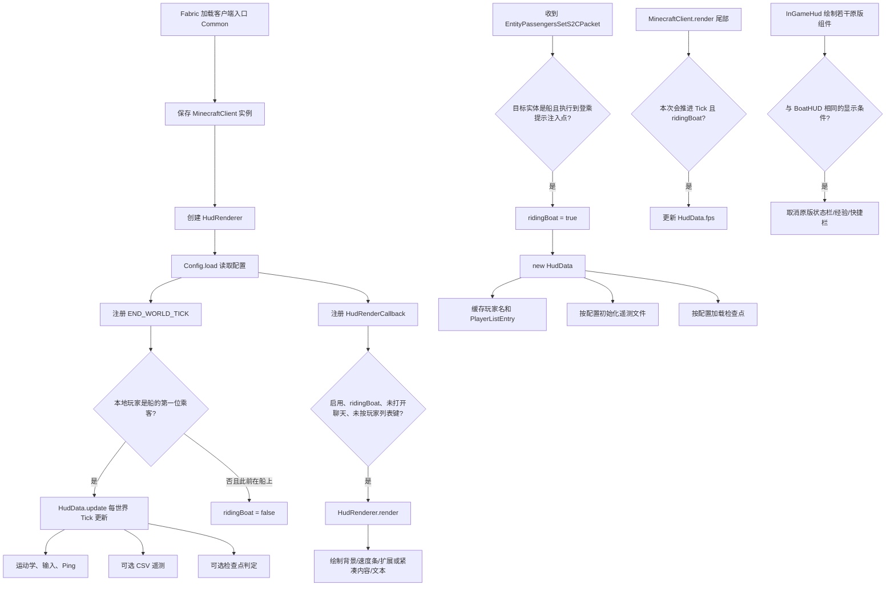

# BoatHUD (Extended) 完整实现逻辑

## 1. 分析范围与项目定位

- 仓库：<https://github.com/jewtvet/boathud_extended>
- 分支：`main`
- 分析快照：提交 `a64b79679e8d64d67a59a0a42ddf9c2643f935ba`（2024-08-02）
- 模组版本：`1.1.0`
- 目标平台：Minecraft 1.21、Fabric Loader、Fabric API
- 运行范围：纯客户端模组（`fabric.mod.json` 的 `environment` 为 `client`）

该模组在玩家驾驶船时，用赛车风格的 BoatHUD 替换屏幕底部的一部分原版 HUD。它实时显示速度、侧滑角、纵/横向加速度、延迟、FPS、按键或操作轨迹；还可将每 Tick 数据写入 CSV，并依据外部检查点文件计算相对基准成绩的时间差与速度差。

本仓库代码量较小，没有服务端逻辑、网络自定义协议、命令、测试或独立数据生成器。功能主要由以下 5 个普通类和 3 个 Mixin 完成。

## 2. 文件与职责

| 文件 | 主要职责 |
| --- | --- |
| `Common.java` | 客户端入口；加载配置；注册世界 Tick 与 HUD 绘制回调；控制“正在驾驶船”的生命周期 |
| `Config.java` | 配置默认值、属性文件读写、单位换算、检查点 CSV 读取 |
| `HudData.java` | 单次乘船会话的运行状态；运动学计算；输入轨迹；遥测写盘；检查点判定 |
| `HudRenderer.java` | 根据 `HudData` 和 `Config` 绘制 HUD 贴图、速度条、G 值点、文字与输入显示 |
| `MenuInteg.java` | 通过 Mod Menu + Cloth Config 构建图形配置页 |
| `ClientPlayNetworkHandlerMixin.java` | 在客户端收到乘客关系同步包且本地玩家登船时，初始化新的 HUD 会话 |
| `InGameHudMixin.java` | BoatHUD 显示期间取消原版状态栏、经验条、经验等级和快捷栏绘制 |
| `MinecraftClientMixin.java` | 在客户端渲染尾部采样当前 FPS |
| `fabric.mod.json` | 模组元数据、客户端/Mod Menu 入口、Mixin 和依赖声明 |
| `boathud_extended.mixins.json` | 注册三个客户端 Mixin |
| `widgets.png` | HUD 背景、速度条、G 值标记、操作轨迹及按键图标的纹理图集 |
| `lang/*.json` | 英文、简体中文和俄文本地化文本 |

## 3. 总体运行链路



`Common.ridingBoat` 是整个模组的总运行开关；`Common.hudData` 则代表一次登船后新建的会话状态。下船只会将 `ridingBoat` 设为 `false`，不会显式清空 `hudData`；下一次触发登船同步时会以新的 `HudData` 覆盖旧对象。

## 4. 启动与生命周期

### 4.1 Fabric 入口

`fabric.mod.json` 将 `jewtvet.boathud_extended.Common` 注册为客户端入口。`Common.onInitializeClient()` 顺序执行：

1. 取得全局 `MinecraftClient`。
2. 创建唯一的 `HudRenderer`。
3. 调用 `Config.load()`。
4. 注册 `ClientTickEvents.END_WORLD_TICK`。
5. 注册 `HudRenderCallback.EVENT`。

另一个 `modmenu` 入口是 `MenuInteg`，只负责向 Mod Menu 提供配置屏幕工厂。

### 4.2 登船检测与会话初始化

`ClientPlayNetworkHandlerMixin` 注入客户端的 `onEntityPassengersSet(...)`。注入点位于原版调用 `InGameHud.setOverlayMessage(...)` 之后，即本地玩家登乘并出现操作提示的代码路径。注入方法再检查乘客包指向的实体是否为 `BoatEntity`：

- 不是船：直接返回。
- 是船：令 `Common.ridingBoat = true`，随后 `Common.hudData = new HudData()`。

`HudData` 构造时：

1. 从本地玩家显示名取得 `name`（该字段之后没有参与渲染或写盘）。
2. 从网络处理器取得该玩家的 `PlayerListEntry`，后续用它读取 Ping。
3. 若遥测已启用，创建本次会话的 CSV 文件并写入表头。
4. 若检查点已启用，按需读取检查点文件。

因此遥测文件和部分功能初始化以“登船时的配置”为边界，并不是所有配置都能在乘船过程中安全地热切换。

### 4.3 每 Tick 更新和下船检测

世界 Tick 结束时，入口回调检查：

```text
玩家存在
└─ 玩家载具是 BoatEntity
   └─ 玩家是该船的第一位乘客
      └─ hudData.update()
```

只有第一位乘客（驾驶位）会更新 BoatHUD。若条件不成立且 `ridingBoat` 此前为 `true`，则将其设为 `false`，从而停止数据更新、HUD 绘制、FPS 采样和原版 HUD 替换。

### 4.4 HUD 的显示条件

自定义 HUD 仅在以下条件全部满足时绘制：

- 本地玩家存在；
- `Config.enabled == true`；
- `Common.ridingBoat == true`；
- 当前界面不是聊天界面；
- 玩家列表键（通常为 Tab）未按下。

聊天界面或玩家列表显示时，BoatHUD 暂时隐藏，同时不再取消对应的原版 HUD，方便查看聊天和列表。

## 5. 数据采集与运动学计算

`HudData.update()` 预计以 Minecraft 标准 20 Tick/s 调用。代码固定使用 `20` 和 `0.05 s`，并不按实际服务器 TPS 或真实经过时间修正。

### 5.1 位置与水平速度

船速只取 XZ 水平面，忽略 Y 方向：

```text
horizontalVelocity = (velocity.x, 0, velocity.z)
speed = |horizontalVelocity| × 20
```

Minecraft 的速度向量单位可理解为“方块/Tick”，因此乘 20 后得到“方块/秒”；这里将一方块按一米显示为 `m/s`。

每 Tick 会保存上一位置 `xPosLast/zPosLast`、当前位置 `xPos/yPos/zPos`、上一速度 `speedLast` 与当前 `speed`。

### 5.2 纵向加速度

```text
gLon = (speed - speedLast) × 20
```

即用相邻 Tick 的标量速度差计算纵向加速度，默认显示为 `m/s²`。字段名虽然带 `g`，但默认存储值并不是重力加速度倍数；只有选择 G 单位后才乘 `0.101972`（约等于除以 9.80665）。

### 5.3 朝向、行进方向和角速度

- `angleFacing = boat.getYaw()`：船头朝向角。
- `angleTravelling = degrees(atan2(-velocity.x, velocity.z))`：由水平速度向量得到的行进方向。
- `angularVelocity = (angleFacing - angleFacingLast) × 20`：船头角速度，保存到遥测，但不显示在 HUD。

角速度差没有执行角度归一化，所以 Yaw 从 `180°` 跳到 `-180°` 或反向跨界时可能产生一个很大的瞬时值。

### 5.4 横向加速度

```text
deltaTravelAngle = radians(angleTravelling - angleTravellingLast)
gLat = sin(deltaTravelAngle / 2) × speedLast × 2 × 20
```

这相当于用相邻速度方向形成的弦长近似横向加速度，保留转向符号。行进角跨过 `±180°` 时差值没有先归一化，数值幅度通常仍接近，但符号可能与实际小角度转向相反。

### 5.5 侧滑角

```text
slipAngle = normalizeTo[-180, 180](angleFacing - angleTravelling)
```

速度为 0 时直接设为 0。内部保留正负号，但 HUD 使用绝对值显示，所以界面只呈现偏差大小，不呈现左右方向。

### 5.6 输入状态

方向输入：

```text
steering = (右键按下 ? -1 : 0) + (左键按下 ? 1 : 0)
```

油门输入：

```text
throttle = (前进键按下 ? 1 : 0) + (后退键按下 ? -0.125 : 0)
```

左右同时按下得到 0；前后同时按下得到 0.875。后退被特意记为 `-0.125`，而不是 `-1`。

### 5.7 输入轨迹

`steeringTrace` 和 `throttleTrace` 都是固定 40 个元素的双端队列，初始全为 0。每 Tick 删除最旧值并追加当前值；标准 20 TPS 下覆盖最近约 2 秒。

### 5.8 Ping、FPS 与会话时间

- Ping：每 Tick 从构造时缓存的 `PlayerListEntry.getLatency()` 更新。
- FPS：`MinecraftClientMixin` 在 `MinecraftClient.render` 尾部调用 `getCurrentFps()`；仅当该次渲染参数 `tick` 为真且 `ridingBoat` 为真时写入。
- 会话时间：每次 `update()` 固定增加 `0.05` 秒。卡顿、暂停或非 20 TPS 状态下它不等于真实墙钟时间。

## 6. HUD 绘制逻辑

### 6.1 坐标与两种布局

HUD 水平居中，垂直基准为：

```text
heightWithOffset = scaledHeight - Config.yOffset + 6
```

默认 `yOffset = 36`。两种布局共用 `widgets.png`，但裁剪不同区域：

| 布局 | 背景宽度 | 纹理 Y 偏移 | 内容 |
| --- | ---: | ---: | --- |
| 扩展 `extended=true` | 218 px | 0 | 速度条、G 值点、油门轨迹、方向轨迹、完整双行数据 |
| 紧凑 `extended=false` | 146 px | 56 | 速度条、四方向按键、精简数据 |

渲染前启用普通 Alpha 混合，渲染结束后关闭混合。

### 6.2 速度条

速度条有三套量程，`barType` 同时决定纹理行、最低/最高速度和像素缩放：

| 类型 | `barType` | 最低速度 | 最高速度 | 扩展比例 | 紧凑比例 | 用途文案 |
| --- | ---: | ---: | ---: | ---: | ---: | --- |
| PACKED | 0 | 0.0 | 40.0 | 5.4 px/(m/s) | 3.6 | 水与浮冰/低速 |
| MIXED | 1 | 0.0 | 72.0 | 3.0 | 2.0 | 混合冰面 |
| BLUE | 2 | 40.0 | 72.7 | 6.6 | 4.4 | 蓝冰高速竞速 |

绘制步骤：

1. 先绘制整条“未点亮”纹理。
2. 若 `speed >= MIN_V` 且 `speed <= MAX_V`，再从左向右裁剪“已点亮”纹理，长度为 `(speed - min) × scale + 1`。
3. 若 `speed > MAX_V`，按世界时间 Tick 的奇偶交替绘制整条点亮纹理，形成约 10 Hz 的超速闪烁。

在速度恰好等于最低值时仍会点亮 1 个像素，这是公式末尾 `+1` 的结果。

### 6.3 G 值表

扩展布局会绘制 18×18 的 G 值底图和一个 2×2 标记：

- 横向位置由 `gLat / 2.5` 决定；
- 纵向位置由 `-gLon / 2.5` 决定；
- 两轴都限制在 `[-8, 8]` 像素；
- 任一加速度绝对值大于 `22.5 m/s²` 时，标记改用警示颜色纹理，否则使用普通颜色。

标记在约 `20 m/s²` 时已经到达边缘，而警示阈值是 `22.5 m/s²`，因此颜色可能在标记贴边之后才变化。

### 6.4 扩展布局内容

扩展布局显示：

- 左上：速度；
- 右上：侧滑角绝对值；
- 下排右侧：Ping、FPS；
- 中央：G 值点；
- 中央左右：最近 40 Tick 的油门与转向轨迹；
- 未启用检查点：左下附近显示“纵向 / 横向加速度”；
- 启用检查点：改为显示检查点时间差和速度差。

油门轨迹的正、负、零分别取纹理图集中的三个颜色像素；转向轨迹固定使用同一个颜色。轨迹的垂直位置只由输入符号决定，正值位于中心线上方 4 px、负值位于下方 4 px、零位于中心线，并不按输入绝对值连续缩放。

### 6.5 紧凑布局内容

紧凑布局显示速度、侧滑角、Ping、FPS，以及以下二选一内容：

- 未启用检查点：纵向加速度；
- 启用检查点：时间差。

它不显示横向加速度、速度差、G 值点和历史轨迹，而是在中下部显示实时按键。按键纹理的次序是：左、后、前、右；按下时叠加高亮图块。

### 6.6 数字格式、单位与颜色

`threeSigFig()` 名称表示“三位有效数字”，实际逻辑是按数值大小决定小数位：

- `abs(value) >= 99.95`：0 位小数；
- `abs(value) >= 9.95`：1 位小数；
- 其他：2 位小数。

单位换算：

| 类型 | 选项 | 内部值乘数 | 后缀 |
| --- | --- | ---: | --- |
| 速度 | MS | 1.0 | `m/s` |
| 速度 | KMPH | 3.6 | `km/h` |
| 速度 | MPH | 2.236936 | `mph` |
| 速度 | KT | 1.943844 | `kt` |
| 加速度 | MSS | 1.0 | `m/s²` |
| 加速度 | G | 0.101972 | `g` |

动态颜色规则：

| 数据 | 红色 | 绿色 | 其他情况 |
| --- | --- | --- | --- |
| Ping | `> 500 ms` | `< 50 ms` | 白色 |
| FPS | `< 120` | `> 240` | 白色 |
| 时间差 | `> +0.025 s` | `< -0.025 s` | 白色 |
| 速度差 | `< -0.4 m/s` | `> +0.4 m/s` | 白色 |

加速度、速度和侧滑角始终用默认文字颜色。横向加速度显示绝对值；纵向加速度保留正负号。

文字对齐通过 `x - textWidth × align / 2` 实现，其中 `align=0/1/2` 分别代表左对齐、居中、右对齐。

## 7. 原版 HUD 替换

`InGameHudMixin` 分别在以下方法开头注入并可取消执行：

- `renderStatusBars`：生命、护甲、饥饿等状态栏；
- `renderExperienceBar`：经验条；
- `renderExperienceLevel`：经验等级数字；
- `renderHotbar`：快捷栏。

取消条件与 BoatHUD 的主要显示条件相同：BoatHUD 已启用、`ridingBoat` 为真、没有打开聊天界面、没有按住玩家列表键。这意味着驾驶船时默认用 BoatHUD 腾出并占据底部区域；打开聊天或玩家列表时恢复原版元素。

## 8. 遥测实现

### 8.1 文件初始化

若玩家登船时 `telemetryEnabled=true`，`HudData` 构造函数把文件名设为：

```text
telemetryDirectory + yyyy-MM-dd_HH-mm-ss + ".csv"
```

默认目录字符串是 `C:/boat_telemetry/`。代码不会自动创建目录，也不会自动补路径分隔符。

文件表头为：

```csv
time,speed,gLon,gLat,slipAngle,angularVelocity,steering,throttle,xPos,zPos,yPos
```

### 8.2 开始条件与逐 Tick 写入

遥测不会在登船后立即记录。当 `telemetryEnabled` 为真且 `throttle > 0.01` 时，`telemetryStart` 被永久设为 `true`；之后本次 `HudData` 会在每个更新 Tick 追加一行，即使玩家后来松开前进键。

每行包含 11 项：时间保留 2 位小数，其余 10 项保留 4 位小数。每次写入都新建一个 `FileWriter(..., true)`、写一行并关闭，没有长期保持缓冲流。

所有 `IOException` 被静默忽略，因此路径不存在、无权限或磁盘写入失败时游戏内不会给出提示。

### 8.3 配置热切换的实际行为

- 登船时关闭遥测、途中再打开：没有执行 `telemetryFileInit()`，`fileName` 仍可能是 `null`；达到启动条件后存在运行时异常风险。
- 登船时已初始化并开始写入、途中关闭遥测：`telemetryStart` 不会复位，后续仍继续写文件。
- 文件名只精确到秒；同一目录同一秒内的两次初始化会覆盖先前文件表头。
- `String.format` 使用 JVM 默认区域设置；在使用逗号作小数点的区域中，数字本身也可能带逗号，从而破坏逗号分隔列结构。

## 9. 检查点与圈速比较

### 9.1 检查点文件格式

`Config.loadCheckpoints()` 清空旧列表后逐行读取 `checkpointFile`。凡是包含字符串 `time` 的行都会跳过；其他行按逗号切分，并读取前 5 项为 `Double[]`：

```text
[0] referenceTime   从起点算起的基准累计时间（秒）
[1] referenceSpeed  经过该点时的基准速度（m/s）
[2] normalX         检查平面在 X 轴上的法向分量
[3] normalZ         检查平面在 Z 轴上的法向分量
[4] threshold       点积阈值
```

几何判定等价于一条位于 XZ 平面的有向直线/竖直平面：

```text
dot(x, z) = x × normalX + z × normalZ
通过条件：dot(currentX, currentZ) > threshold
```

读取异常全部被静默忽略。若中途某一行格式错误，读取循环会直接中止，但错误前已经加入的数据仍会保留。最终 `checkpoints = checkpointdata.size()`，并记录本次已加载的路径 `checkpointFileLoaded`。

### 9.2 加载时机

- 程序启动加载配置后，若 `checkpointEnabled=true`，立即读取一次。
- 新建 `HudData` 时，若检查点已启用且 `checkpointFileLoaded` 与当前配置路径不同，再读取一次。
- 配置菜单保存路径本身不会直接触发重新读取；通常要等下一次创建 `HudData`。

### 9.3 过线时间的 Tick 内插值

当前检查点索引是 `cp`。当当前位置点积超过当前阈值时，代码用上一 Tick 与当前 Tick 的点积估计在本 Tick 内的穿越比例：

```text
dotLast = dot(previousPosition)
subtick = clamp((threshold - dotLast) / (dotNow - dotLast), 0, 1)
subtickTime = time - 0.05 + subtick × 0.05
```

第 0 个检查点被当作起点，穿越时把 `startTime` 设为 `subtickTime`。每个检查点的时间差为：

```text
delta = subtickTime - startTime - referenceTime
```

正值代表慢于基准，负值代表快于基准，并据此变红或变绿。

代码中的速度差实际计算式是：

```text
speedDiff = speedLast × subtick + speed × (1 - subtick) - referenceSpeed
```

正值代表比基准快。需要注意，这个权重与常见线性插值 `speedLast × (1-subtick) + speed × subtick` 相反；因此源码计算的是反向权重结果。

### 9.4 多检查点与环形赛道

一次 Tick 内使用循环判定：通过一个检查点后 `cp++`，随后立即用同一当前位置检查下一个检查点，所以高速移动跨越多个检查面时可以一次推进多个索引。

- 非环形赛道：通过最后一点后 `cp == checkpoints`，后续不再判定，最后一次的 `delta/speedDiff` 保留显示。
- 环形赛道：到达末尾后执行 `cp -= checkpoints`，回到 0，并继续作为下一圈起点使用。

判定只检查“当前位置点积大于阈值”，没有明确要求“上一位置在阈值另一侧”。因此在检查面正侧生成/启用功能时也可能立即触发；若环形检查点的方向和阈值配置不当，使同一位置同时满足循环中的各检查点，还存在单 Tick 循环无法结束的风险。

## 10. 配置系统

### 10.1 持久化文件

配置文件位于 Fabric 配置目录下的 `boathud.properties`。它不是 Java 标准 `Properties` API，而是逐行匹配固定前缀的自定义空格分隔格式：

```properties
enabled true
extended true
telemetryEnabled false
telemetryDirectory C:/boat_telemetry/
checkpointEnabled false
checkpointFile C:/checkpoints.cf
circularTrack false
yoffset 36
barType 0
speedUnit 0
accelerationUnit 0
```

加载时未知行会被忽略；任意解析异常会终止整个读取过程且不给提示。只对 `barType` 做了 `[0,2]` 范围校验，非法值回退为 0；其他数值没有额外范围验证。保存时直接覆盖原文件，异常同样静默忽略。

### 10.2 默认配置

| 配置 | 默认值 | 作用 |
| --- | --- | --- |
| `enabled` | `true` | 总开关 |
| `extended` | `true` | 扩展/紧凑布局 |
| `yOffset` | `36` | HUD 相对屏幕底部的垂直偏移 |
| `barType` | `0` | 速度条类型：PACKED/MIXED/BLUE |
| `speedType` | `0` | 速度单位 |
| `accelerationType` | `0` | 加速度单位 |
| `telemetryEnabled` | `false` | 遥测开关 |
| `telemetryDirectory` | `C:/boat_telemetry/` | 遥测文件名前缀/目录 |
| `checkpointEnabled` | `false` | 检查点开关 |
| `checkpointFile` | `C:/checkpoints.cf` | 检查点数据文件 |
| `circularTrack` | `false` | 末点后回到第 0 点 |

### 10.3 Mod Menu 配置页

`MenuInteg` 使用 Cloth Config 创建：

- 启用开关；
- 扩展 HUD 开关；
- Y 偏移滑块（0～300）；
- 速度条枚举；
- 速度单位枚举；
- 加速度单位枚举；
- “遥测”子分类：开关、目录字符串；
- “检查点”子分类：开关、文件字符串、环形赛道开关。

点击保存后，各控件的 `saveConsumer` 先更新 `Config` 静态字段，最后由 `builder.setSavingRunnable(Config::save)` 写入配置文件。

## 11. 资源、本地化与构建

### 11.1 纹理与语言

`widgets.png` 是 256×256 纹理图集，代码用硬编码像素坐标裁剪所需片段。语言文件提供英文、简体中文、俄文。

当前资源存在几项不影响核心算法、但会影响界面完整性的事实：

- 配置分类使用 `boathud.config.cat`，三个语言文件都未定义该键，因此界面可能直接显示键名。
- 俄文文件缺少遥测、检查点、加速度单位等多项键，且使用了未被代码读取的 `boathud.option.extras`，Y 偏移文案为空。
- Mod Menu 描述键以 `boathud` 结尾，而模组 ID 是 `boathud_extended`；如果 Mod Menu 按模组 ID 查找翻译，这些键不会匹配。

### 11.2 构建依赖

Gradle 配置使用 Fabric Loom，主要版本为：

- Minecraft `1.21`
- Yarn `1.21+build.2`
- Fabric Loader `0.15.11`
- Fabric API `0.100.4+1.21`
- Mod Menu `11.0.0`
- Cloth Config `15.0.127`

构建脚本声明 Java 源/目标版本 17，Mixin 配置也标记 `JAVA_17`；但 `fabric.mod.json` 要求 Java `>=21`，Minecraft 1.21 本身也使用 Java 21。这是仓库声明层面的不一致，实际构建/运行环境应采用 Java 21，并最好同步修正 Gradle 与 Mixin 的兼容级别。

`processResources` 声明了版本输入并对 `*.mod.json` 执行变量展开，不过 `fabric.mod.json` 中版本是硬编码 `1.1.0`，没有使用 `${version}` 占位符。`jar` 任务还尝试打包根目录 `LICENSE`，但当前提交没有该文件；元数据则声明许可证为 MIT。

## 12. 完整时序示例

一次典型使用流程如下：

1. 启动 Minecraft，Fabric 调用 `Common.onInitializeClient()`。
2. 模组读取 `boathud.properties`，若启用了检查点，也读取检查点文件。
3. 玩家进入世界并登上一艘船；服务端乘客同步包到达客户端。
4. Mixin 识别船的登乘路径，设置 `ridingBoat=true`，创建新的 `HudData`。
5. 若登船时已启用遥测，创建带时间戳的 CSV；若检查点路径有变化，重载检查点。
6. 每个世界 Tick 结束时确认玩家仍是船的第一位乘客，然后更新位置、速度、加速度、角度、按键、轨迹和 Ping。
7. 玩家第一次按前进键后，遥测开始逐 Tick 写入；之后不因松键停止。
8. 每次穿过当前检查平面，计算 Tick 内穿越时间、相对时间差、速度差并推进索引。
9. 每帧 HUD 回调满足显示条件时，按扩展或紧凑布局绘制纹理和文本。
10. 同期 Mixin 隐藏原版底部 HUD；另一个 Mixin在推进 Tick 的渲染尾部更新 FPS。
11. 玩家下船或不再是第一位乘客，下一次世界 Tick 将 `ridingBoat=false`，停止本次会话的更新与绘制。

## 13. 源码边界与已知风险汇总

以下是从当前实现直接可见的行为，不是对项目目标的推测：

1. 大量文件 I/O 和解析异常被完全吞掉，配置、遥测、检查点失败时没有日志或界面反馈。
2. 遥测目录不会创建；路径要求调用者自己提供正确分隔符和已存在目录。
3. 遥测开关不支持可靠的乘船中热切换；关闭后也可能继续写入。
4. 时间固定按 20 TPS 推进，不代表真实时间；运动导数也会受客户端/服务器 Tick 状态影响。
5. 角速度和行进方向变化没有统一做跨 `±180°` 归一化。
6. 检查点速度插值权重与标准线性插值相反。
7. 检查点只验证当前位置位于有向平面的正侧，没有严格的“由负侧穿到正侧”检测。
8. 环形检查点配置不当时，同一 Tick 的动态循环可能持续反复推进。
9. `HudData.update()` 依赖登船 Mixin 已先创建 `hudData`；生命周期正确时成立，但代码本身没有空值保护。
10. 配置仅校验 `barType`；损坏的单位索引可能在 Mod Menu 用 `Enum.values()[index]` 时越界。
11. `assert` 用于若干非空假设，而 Java 默认通常不开启断言；真正的空值仍可能在后续语句触发异常。
12. Java 17/21、翻译键和许可证文件存在上述声明或资源不一致。

## 14. 一句话架构总结

这是一个以静态全局状态协调的事件驱动客户端模组：网络包注入负责开启乘船会话，世界 Tick 负责生成全部驾驶数据和文件输出，HUD 回调负责只读渲染，原版 HUD/FPS 的 Mixin 补齐显示替换与性能指标，而 Mod Menu + 自定义文本文件负责配置入口和持久化。
